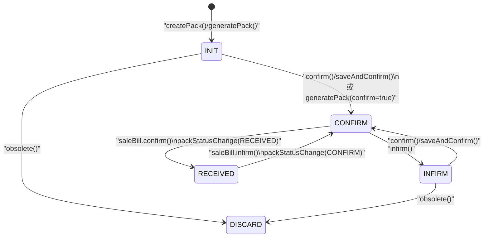
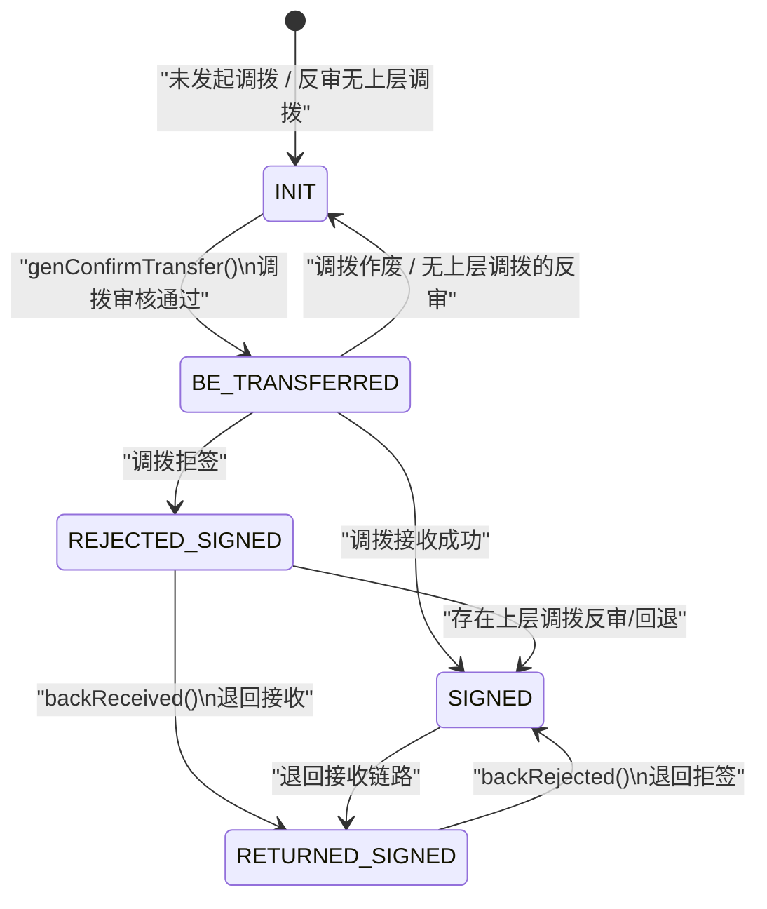

# 产品包状态机图
> 基于 commit: `48af575a1314636c88e9f05ca3cb4443f88865bd`，日期：2026-03-31

## 说明
- 产品包至少有两套独立但相关的状态：
  - `wh_pack.pack_status` 主状态
  - `wh_pack.transfer_status` 调拨状态
- 后续改造时必须区分“产品包已审核/已结算”和“产品包处于何种调拨阶段”，不能混在一起判断。

## 产品包主状态机

## 产品包调拨状态机

## 关键迁移说明

### 主状态 `pack_status`
1. `createPack()` / `generatePack()` 新建后进入 `INIT`。
2. `confirm()`、`saveAndConfirm()`、`generatePack(confirm=true)` 可把 `INIT/INFIRM -> CONFIRM`。
3. `infirm()` 可把 `CONFIRM -> INFIRM`。
4. `obsolete()` 可把 `INIT/INFIRM -> DISCARD`。
5. `saleBill.confirm()` 会通过 `packService.packStatusChange(packList, RECEIVED)` 把产品包推进到 `RECEIVED`。
6. `saleBill.infirm()` 会把产品包从 `RECEIVED` 还原到 `CONFIRM`。

### 调拨状态 `transfer_status`
1. `pack.genConfirmTransfer()` 在单件/成品两种场景下，调拨审核通过后都会回写：
   - `transferBillId`
   - `transferBillNo`
   - `transferType`
   - `transferStatus = BE_TRANSFERRED`
2. 单件调拨/成品调拨接收后，产品包进入“已签收”类终态。
3. 调拨拒签后，产品包 `transferStatus -> REJECTED_SIGNED`。
4. 退回接收后，产品包 `transferStatus -> RETURNED_SIGNED`。
5. 退回拒签后，产品包 `transferStatus -> SIGNED`。
6. 调拨作废时会清空 `transferBillId / transferBillNo`；无上层调拨场景下，反审也可能把调拨状态回到 `INIT`。

## 关键前置条件
| 动作 | 关键前置条件 |
|------|-------------|
| `confirm` | `pack_status` 必须是 `INIT/INFIRM`，客留存非空，包明细非空 |
| `infirm` | `pack_status` 必须是 `CONFIRM`，且 `transferStatus` 不能处于调拨中 |
| `obsolete` | `pack_status` 必须是 `INIT/INFIRM`，且 `transferStatus` 不能处于调拨中 |
| `genConfirmTransfer` | 必须指定结算仓 `saleWareId`，且产品包存在 |

## 关联影响
1. 主状态推进会联动：
   - 客留存 `pack_no/status`
   - 客户订单明细 `local_status`
   - 展销明细
   - 维修单关联数量
2. 调拨状态推进会联动：
   - 单件调拨单 / 成品调拨单
   - 结算单 `transferStatus`（成品调拨场景）
   - 产品包 `transferBillId / transferBillNo / transferType`

## 使用建议
- 后续 AI 若修改 `wh_pack.pack_status` 或 `wh_pack.transfer_status`，必须同时检查：
  - [pack.md](/D:/ws/code/wms-api/docs/business/pack.md)
  - [transferbill.md](/D:/ws/code/wms-api/docs/business/transferbill.md)
  - [goodstransferbill.md](/D:/ws/code/wms-api/docs/business/goodstransferbill.md)
  - [salebill.md](/D:/ws/code/wms-api/docs/business/salebill.md)
  - [customerretain.md](/D:/ws/code/wms-api/docs/business/customerretain.md)
  - [customerorder.md](/D:/ws/code/wms-api/docs/business/customerorder.md)
