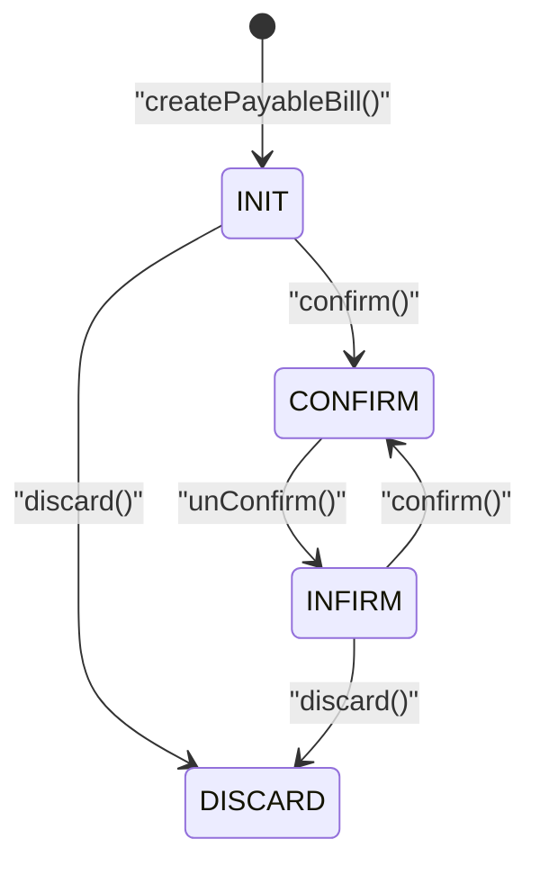

# 付款单状态机图
> 基于 commit: `48af575a1314636c88e9f05ca3cb4443f88865bd`，日期：2026-03-31

## 说明
- 付款单沿用标准 `BillStatusEnum`，核心状态是 `INIT`、`CONFIRM`、`INFIRM`、`DISCARD`。
- 与收款单不同，付款单没有 `DIVIDE` 这样的扩展状态。
- 反审不会回到 `INIT`，而是进入独立 `INFIRM`，后续允许继续修改或重新审核。

## Mermaid

## 关键迁移说明
1. `updatePayableBill()` 只允许在 `INIT` 或 `INFIRM` 修改。
2. `confirm()` 会把单据推进到 `CONFIRM`，同时触发银行和钱包两条资金链落账。
3. `unConfirm()` 会把单据推进到 `INFIRM`，并完整回滚审核时的资金影响。
4. `discard()` 仅禁止 `CONFIRM` 态，允许 `INIT/INFIRM` 作废。

## 关键前置条件
| 动作 | 关键前置条件 |
|------|-------------|
| `updatePayableBill` | 当前状态必须是 `INIT` 或 `INFIRM` |
| `confirm` | 当前状态不能已经是 `CONFIRM` |
| `unConfirm` | 当前状态必须是 `CONFIRM`，跨日还要具备 `PAYABLE_BILL_CROSS_DAYS` 权限 |
| `discard` | 当前状态不能是 `CONFIRM` |

## 逻辑可疑
| 标记 | 方法 | 摘要 |
|------|------|------|
| ⚠️ | `confirm` | 当前实现只拦重复审核，未显式拦截 `DISCARD` 等异常状态再次审核 |
| ⚠️ | `deletePayableBill` | 删除动作未体现状态校验，也未体现明细级联清理 |
