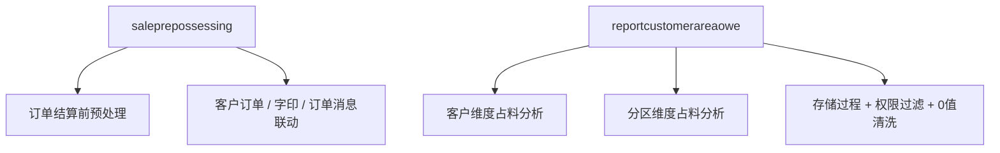

# 预处理与占料分析尾项能力图

```mermaid
flowchart TD
    A["saleprepossessing"] --> A1["订单结算前预处理"]
    A --> A2["客户订单 / 字印 / 订单消息联动"]
    B["reportcustomerareaowe"] --> B1["客户维度占料分析"]
    B --> B2["分区维度占料分析"]
    B --> B3["存储过程 + 权限过滤 + 0值清洗"]
```
