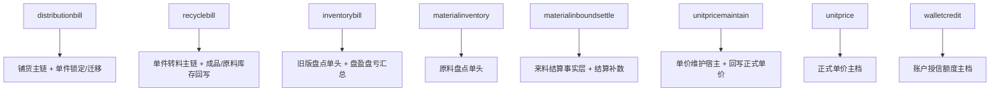

# 价格、盘点与铺货尾项能力图

```mermaid
flowchart TD
    A["distributionbill"] --> B["铺货主链 + 单件锁定/迁移"]
    C["recyclebill"] --> D["单件转料主链 + 成品/原料库存回写"]
    E["inventorybill"] --> F["旧版盘点单头 + 盘盈盘亏汇总"]
    G["materialinventory"] --> H["原料盘点单头"]
    I["materialinboundsettle"] --> J["来料结算事实层 + 结算补数"]
    K["unitpricemaintain"] --> L["单价维护宿主 + 回写正式单价"]
    M["unitprice"] --> N["正式单价主档"]
    O["walletcredit"] --> P["账户授信额度主档"]
```
