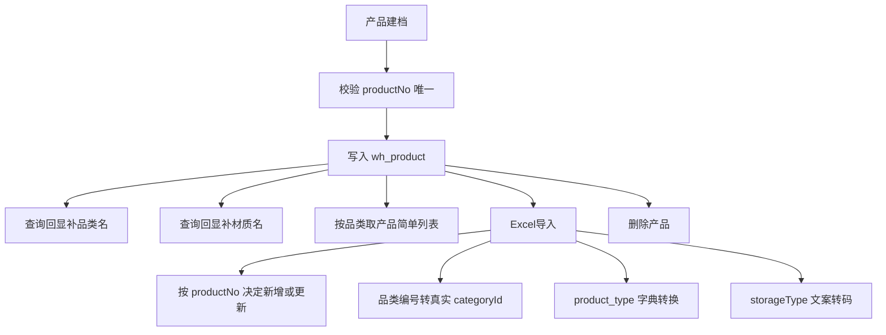

# 产品资料能力图

```mermaid
flowchart TD
    A["产品建档"] --> B["校验 productNo 唯一"]
    B --> C["写入 wh_product"]

    C --> D["查询回显补品类名"]
    C --> E["查询回显补材质名"]
    C --> F["按品类取产品简单列表"]

    C --> G["Excel导入"]
    G --> H["按 productNo 决定新增或更新"]
    G --> I["品类编号转真实 categoryId"]
    G --> J["product_type 字典转换"]
    G --> K["storageType 文案转码"]

    C --> L["删除产品"]
```
