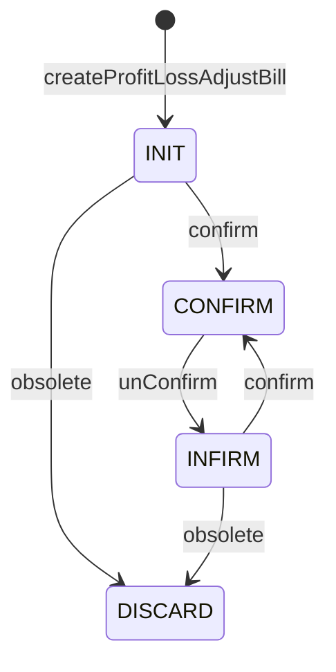

# 盈亏调整单状态机图
> 来源：`ProfitLossAdjustBillServiceImpl`

## 说明
- `confirm` 使用 `BillStatusEnum.confirmCheck()`，可审核状态收敛在标准单据状态机内。
- `unConfirm` 只允许从 `CONFIRM` 回到 `INFIRM`。
- `obsolete` 也走 `BillStatusEnum.obsoleteCheck()`，不是任意状态都能作废。
- 当前没看到 BPM 审批状态分支，审核/反审都是业务接口直接驱动。
