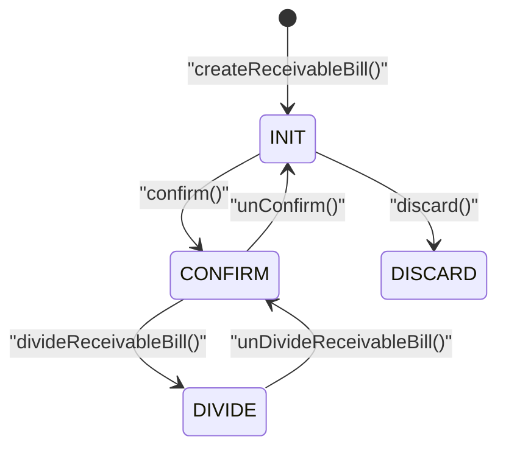

# 收款单状态机图
> 基于 commit: `48af575a1314636c88e9f05ca3cb4443f88865bd`，日期：2026-03-31

## 说明
- 收款单状态并非普通 `INIT -> CONFIRM -> INFIRM` 模型，而是 `ReceivableDivideEnum` 定义的四态：`INIT`、`CONFIRM`、`DIVIDE`、`DISCARD`。
- `DIVIDE` 不是附属标签，而是显式单据状态，表示该笔已审核收款已完成钱包分账。
- 反审不会进入独立 `INFIRM`，而是直接回到 `INIT`。

## Mermaid

## 关键迁移说明
1. `createReceivableBill()` 与 `updateReceivableBill()` 都只发生在 `INIT` 链路。
2. `confirm()` 触发真正的资金入账：
   - 银行卡余额与银行日志
   - 钱包余额与钱包日志
3. `unConfirm()` 把状态退回 `INIT`，同时双向回滚银行与钱包。
4. `divideReceivableBill()` 只允许在 `CONFIRM` 后执行，状态进入 `DIVIDE`。
5. `unDivideReceivableBill()` 把多个分账账户的钱包影响冲回，再把整笔金额挂回原账户，状态回到 `CONFIRM`。

## 关键前置条件
| 动作 | 关键前置条件 |
|------|-------------|
| `updateReceivableBill` | 当前状态必须是 `INIT` |
| `confirm` | 当前状态不能已经是 `CONFIRM` |
| `unConfirm` | 当前状态必须是 `CONFIRM`，跨日还要具备 `RECEIVABLE_BILL_CROSS_DAYS` 权限 |
| `divideReceivableBill` | 当前状态必须是 `CONFIRM`，且分账金额总和必须等于收款金额 |
| `unDivideReceivableBill` | 当前状态必须是 `DIVIDE`，且分账金额总和必须等于收款金额 |
| `discard` | 当前状态不能是 `CONFIRM` |

## 逻辑可疑
| 标记 | 方法 | 摘要 |
|------|------|------|
| ⚠️ | `discard` | 代码只拦 `CONFIRM`，未拦 `DIVIDE`，已分账单据可能被直接作废而不回滚钱包分配 |
| ⚠️ | `updateReceivableBill` | 提示文案提到“已反审可修改”，但状态机中没有独立 `INFIRM` 状态 |
