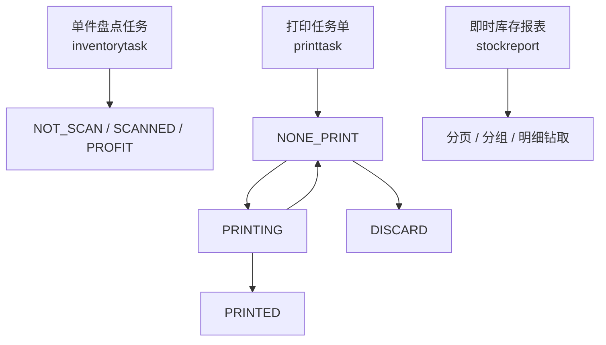

# 报表与任务状态图

```mermaid
flowchart TD
    A["单件盘点任务<br/>inventorytask"] --> A1["NOT_SCAN / SCANNED / PROFIT"]
    B["打印任务单<br/>printtask"] --> B1["NONE_PRINT"]
    B1 --> B2["PRINTING"]
    B2 --> B3["PRINTED"]
    B2 --> B1
    B1 --> B4["DISCARD"]
    C["即时库存报表<br/>stockreport"] --> C1["分页 / 分组 / 明细钻取"]
```
