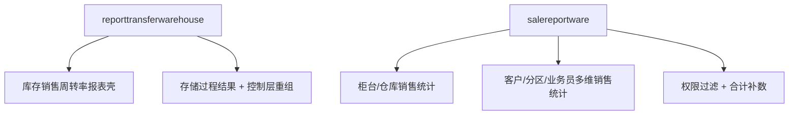

# 柜台与周转率报表尾项能力图

```mermaid
flowchart TD
    A["reporttransferwarehouse"] --> A1["库存销售周转率报表壳"]
    A --> A2["存储过程结果 + 控制层重组"]
    B["salereportware"] --> B1["柜台/仓库销售统计"]
    B --> B2["客户/分区/业务员多维销售统计"]
    B --> B3["权限过滤 + 合计补数"]
```
