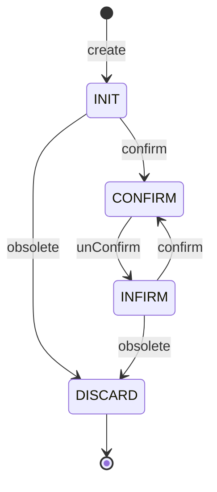

# 客户退货单状态机图

```mermaid
stateDiagram-v2
    [*] --> INIT : create
    INIT --> CONFIRM : confirm
    INIT --> DISCARD : obsolete
    CONFIRM --> INFIRM : unConfirm
    INFIRM --> CONFIRM : confirm
    INFIRM --> DISCARD : obsolete
    DISCARD --> [*]
```

## 说明
1. 审核后同时影响库存、钱包和维修单流转仓库
2. 反审前除状态外，还要检查跨日权限和单件当前仓库/锁定状态
