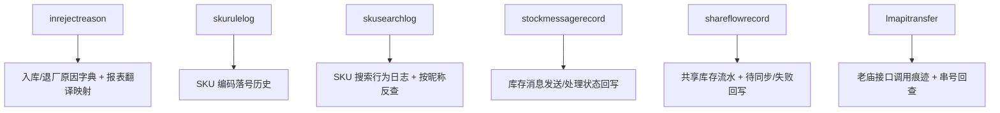

# 规则、日志与记录尾项能力图

```mermaid
flowchart TD
    A["inrejectreason"] --> B["入库/退厂原因字典 + 报表翻译映射"]
    C["skurulelog"] --> D["SKU 编码落号历史"]
    E["skusearchlog"] --> F["SKU 搜索行为日志 + 按昵称反查"]
    G["stockmessagerecord"] --> H["库存消息发送/处理状态回写"]
    I["shareflowrecord"] --> J["共享库存流水 + 待同步/失败回写"]
    K["lmapitransfer"] --> L["老庙接口调用痕迹 + 串号回查"]
```
