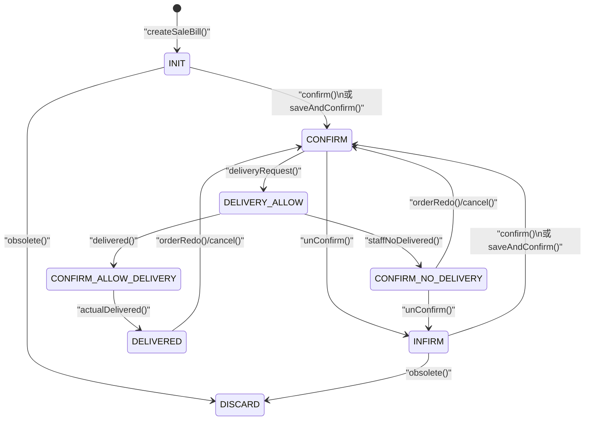

# 出库结算单状态机图
> 基于 commit: `48af575a1314636c88e9f05ca3cb4443f88865bd`，日期：2026-03-31

## 说明
- `wh_sale_bill.bill_status` 是结算单主状态，覆盖建单、审核、发货申请、确认可发货、实际发货、重做等阶段。
- 结算单状态变化不会只影响自身，通常还会联动产品包、客户订单明细、客留存、库存和出货单。
- 后续改造时，不能只看 `wh_sale_bill`，必须同时核对 [salebill.md](/D:/ws/code/wms-api/docs/business/salebill.md) 和 [deliverybill.md](/D:/ws/code/wms-api/docs/business/deliverybill.md)。

## 结算单主状态机

## 关键迁移说明

### 建单到审核
1. `createSaleBill()` 新建后进入 `INIT`。
2. `confirm()`、`saveAndConfirm()` 可把 `INIT/INFIRM -> CONFIRM`。
3. 审核通过时会联动：
   - `wh_pack.pack_status -> RECEIVED`
   - `wh_customer_order_item.local_status -> BILLED`
   - 客户钱包和钱包日志

### 发货申请到实际发货
1. `deliveryRequest()` 把结算单从 `CONFIRM -> DELIVERY_ALLOW`。
2. `delivered()` 把结算单从 `DELIVERY_ALLOW -> CONFIRM_ALLOW_DELIVERY`。
3. `actualDelivered()` 把结算单从 `CONFIRM_ALLOW_DELIVERY -> DELIVERED`，并同时执行：
   - 扣减单件/成品库存
   - `customerRetainService.retainSettled(...)`
   - `customerOrderService.orderShipment(...)`
   - 生成出货单

### 不发货与重做
1. `staffNoDelivered()` 把结算单从 `DELIVERY_ALLOW -> CONFIRM_NO_DELIVERY`。
2. `orderRedo()` 实际调用 `cancel()`，可把：
   - `DELIVERED -> CONFIRM`
   - `CONFIRM_NO_DELIVERY -> CONFIRM`
3. 若原状态是 `DELIVERED`，重做还会执行：
   - 库存回滚
   - `retainSettledBack(...)`
   - `orderShipmentBack(...)`

### 反审与作废
1. `unConfirm()` 可把 `CONFIRM/CONFIRM_NO_DELIVERY -> INFIRM`。
2. 反审时会联动：
   - `wh_pack.pack_status -> CONFIRM`
   - `wh_customer_order_item.local_status -> SETTLEMENT`
   - 钱包回滚
3. `obsolete()` 可把 `INIT/INFIRM -> DISCARD`，并把订单明细退回 `BILLING`，同时取消产品包与结算单关联。

## 关键前置条件
| 动作 | 关键前置条件 |
|------|-------------|
| `confirm` | 单据状态必须是 `INIT/INFIRM`，客户存在，结算方式非空，结算金重必须等于产品包金重 |
| `unConfirm` | 单据状态必须是 `CONFIRM/CONFIRM_NO_DELIVERY`，且结算单调拨状态不能处于调拨中 |
| `obsolete` | 单据状态必须是 `INIT/INFIRM`，且结算单调拨状态不能处于调拨中 |
| `deliveryRequest` | 单据状态必须是 `CONFIRM` |
| `delivered` | 单据状态必须是 `DELIVERY_ALLOW` |
| `actualDelivered` | 单据状态必须是 `CONFIRM_ALLOW_DELIVERY` |
| `staffNoDelivered` | 单据状态必须是 `DELIVERY_ALLOW` |
| `orderRedo` | 单据状态必须是 `DELIVERED/CONFIRM_NO_DELIVERY` |

## 与上下游实体的联动
1. 创建/修改结算单时：
   - `wh_customer_order_item.local_status -> SETTLEMENT`
   - `wh_pack.sale_bill_id / sale_bill_no` 写入当前结算单
2. 审核结算单时：
   - `wh_pack.pack_status -> RECEIVED`
   - `wh_customer_order_item.local_status -> BILLED`
3. 反审结算单时：
   - `wh_pack.pack_status -> CONFIRM`
   - `wh_customer_order_item.local_status -> SETTLEMENT`
4. 作废结算单时：
   - 取消产品包挂单
   - `wh_customer_order_item.local_status -> BILLING`
5. 实际发货时：
   - 推进客留存结留存
   - 推进客户订单出货信息
   - 生成出货单，真正的“发货成功”仍需等 [deliverybill.md](/D:/ws/code/wms-api/docs/business/deliverybill.md) 的异步回调

## 逻辑可疑
| 标记 | 方法 | 摘要 | 处理建议 |
|------|------|------|----------|
| ⚠️ | `deliveryRequest` | 接口名叫“发货申请”，状态枚举也存在 `DELIVERY_REQUESTING` 语义，但实现直接把状态改成 `DELIVERY_ALLOW` | 确认 `DELIVERY_REQUESTING` 是否已废弃 |
| ⚠️ | `staffNoDelivered` | 先执行 `updateByIdAndStatus()`，随后又直接执行一次 `updateById()`，存在重复更新 | 确认第二次更新是否属于遗留冗余逻辑 |

## 使用建议
- 后续 AI 若修改 `wh_sale_bill.bill_status`，至少同步检查：
  - [salebill.md](/D:/ws/code/wms-api/docs/business/salebill.md)
  - [deliverybill.md](/D:/ws/code/wms-api/docs/business/deliverybill.md)
  - [pack.md](/D:/ws/code/wms-api/docs/business/pack.md)
  - [customerorder.md](/D:/ws/code/wms-api/docs/business/customerorder.md)
  - [customerretain.md](/D:/ws/code/wms-api/docs/business/customerretain.md)
