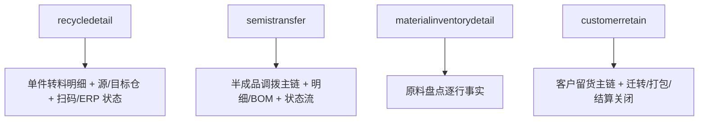

# 半成品、转料与客留尾项能力图

```mermaid
flowchart TD
    A["recycledetail"] --> B["单件转料明细 + 源/目标仓 + 扫码/ERP 状态"]
    C["semistransfer"] --> D["半成品调拨主链 + 明细/BOM + 状态流"]
    E["materialinventorydetail"] --> F["原料盘点逐行事实"]
    G["customerretain"] --> H["客户留货主链 + 迁转/打包/结算关闭"]
```
