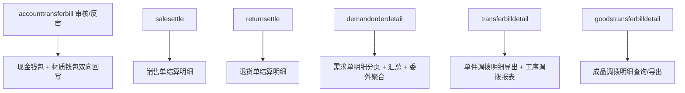

# 结算与调拨明细能力图

```mermaid
flowchart TD
    A["accounttransferbill 审核/反审"] --> B["现金钱包 + 材质钱包双向回写"]
    C["salesettle"] --> D["销售单结算明细"]
    E["returnsettle"] --> F["退货单结算明细"]
    G["demandorderdetail"] --> H["需求单明细分页 + 汇总 + 委外聚合"]
    I["transferbilldetail"] --> J["单件调拨明细导出 + 工序调拨报表"]
    K["goodstransferbilldetail"] --> L["成品调拨明细查询/导出"]
```

