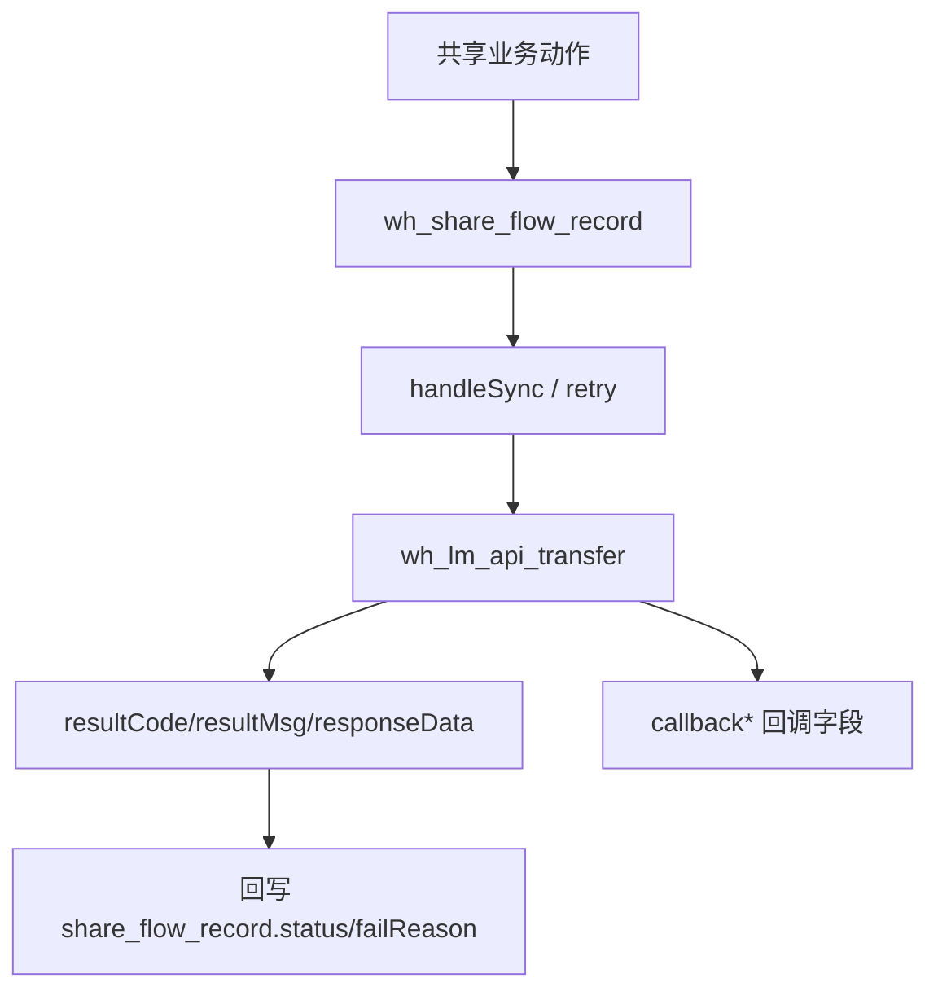

# 共享流水与老庙接口痕迹状态图

```mermaid
flowchart TD
    A["共享业务动作"] --> B["wh_share_flow_record"]
    B --> C["handleSync / retry"]
    C --> D["wh_lm_api_transfer"]
    D --> E["resultCode/resultMsg/responseData"]
    D --> F["callback* 回调字段"]
    E --> G["回写 share_flow_record.status/failReason"]
```
