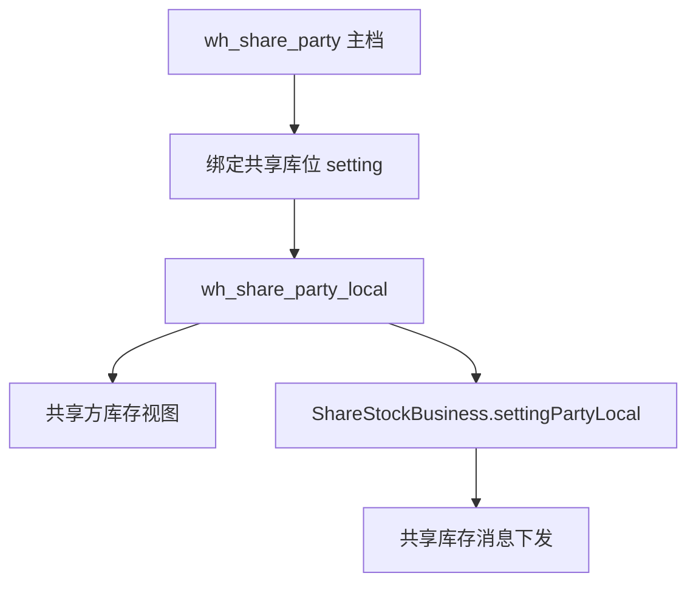

# 共享方状态图

```mermaid
flowchart TD
    A["wh_share_party 主档"] --> B["绑定共享库位 setting"]
    B --> C["wh_share_party_local"]
    C --> D["共享方库存视图"]
    C --> E["ShareStockBusiness.settingPartyLocal"]
    E --> F["共享库存消息下发"]
```
