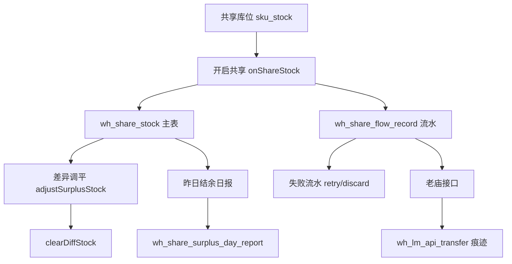

# 共享库存状态图

```mermaid
flowchart TD
    A["共享库位 sku_stock"] --> B["开启共享 onShareStock"]
    B --> C["wh_share_stock 主表"]
    B --> D["wh_share_flow_record 流水"]
    D --> E["老庙接口"]
    E --> F["wh_lm_api_transfer 痕迹"]

    C --> G["差异调平 adjustSurplusStock"]
    G --> H["clearDiffStock"]

    D --> I["失败流水 retry/discard"]
    C --> J["昨日结余日报"]
    J --> K["wh_share_surplus_day_report"]
```
