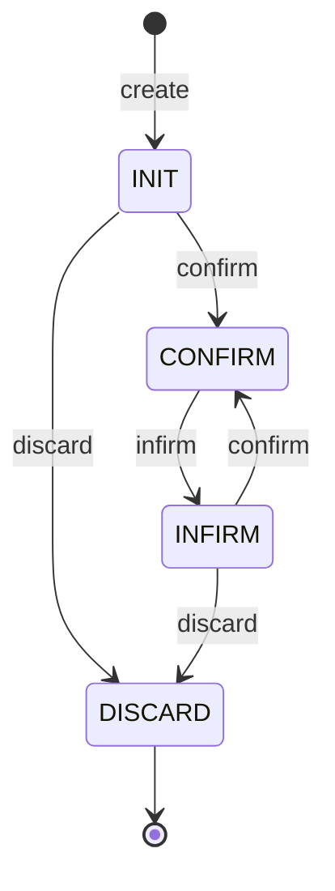

# 库位调整单状态机图

```mermaid
stateDiagram-v2
    [*] --> INIT : create
    INIT --> CONFIRM : confirm
    INIT --> DISCARD : discard
    CONFIRM --> INFIRM : infirm
    INFIRM --> CONFIRM : confirm
    INFIRM --> DISCARD : discard
    DISCARD --> [*]
```

## 说明
1. 建单即锁定 EPC，但真正执行库位变更发生在 `confirm()`。
2. `confirm()` 会同时改单件库位、库存库位分布并释放锁。
3. `infirm()` 会同时回滚库位和库存，并把 EPC 重新锁回本单。
