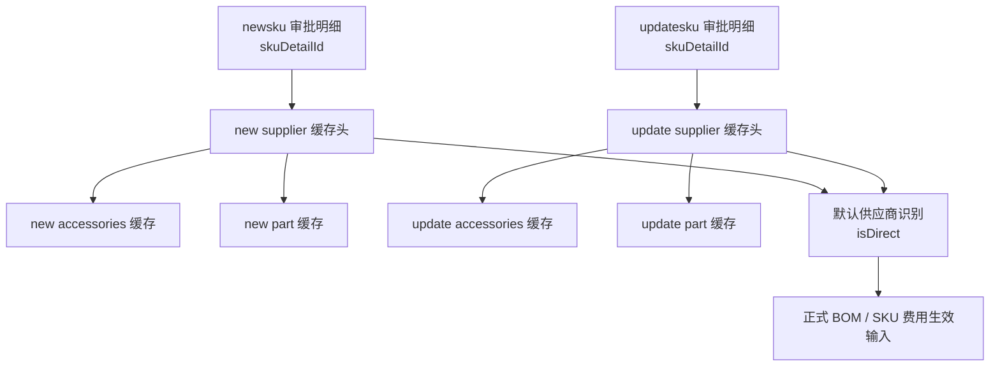

# SKU 审批域 BOM 缓存状态图

```mermaid
flowchart TD
    A["newsku 审批明细<br/>skuDetailId"] --> B["new supplier 缓存头"]
    B --> C["new accessories 缓存"]
    B --> D["new part 缓存"]
    E["updatesku 审批明细<br/>skuDetailId"] --> F["update supplier 缓存头"]
    F --> G["update accessories 缓存"]
    F --> H["update part 缓存"]
    B --> I["默认供应商识别<br/>isDirect"]
    F --> I
    I --> J["正式 BOM / SKU 费用生效输入"]
```
