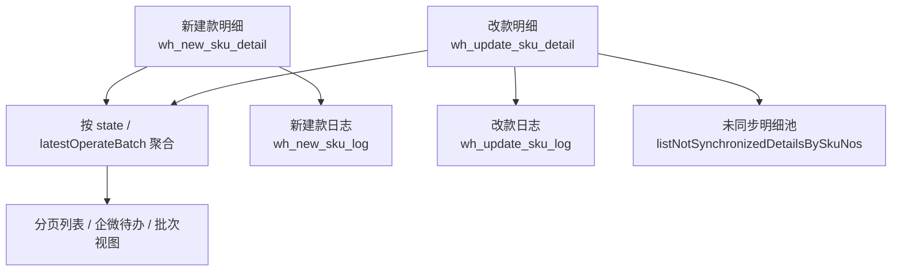

# SKU 审批域明细状态图

```mermaid
flowchart TD
    A["新建款明细<br/>wh_new_sku_detail"] --> C["按 state / latestOperateBatch 聚合"]
    B["改款明细<br/>wh_update_sku_detail"] --> C
    A --> D["新建款日志<br/>wh_new_sku_log"]
    B --> E["改款日志<br/>wh_update_sku_log"]
    C --> F["分页列表 / 企微待办 / 批次视图"]
    B --> G["未同步明细池<br/>listNotSynchronizedDetailsBySkuNos"]
```
