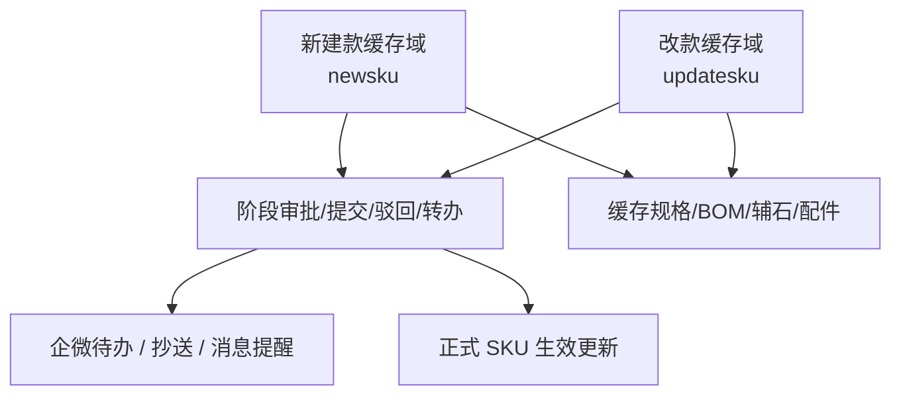

# SKU 新建/改款审批域状态图

```mermaid
flowchart TD
    A["新建款缓存域<br/>newsku"] --> C["阶段审批/提交/驳回/转办"]
    B["改款缓存域<br/>updatesku"] --> C
    C --> D["企微待办 / 抄送 / 消息提醒"]
    C --> E["正式 SKU 生效更新"]
    A --> F["缓存规格/BOM/辅石/配件"]
    B --> F
```
