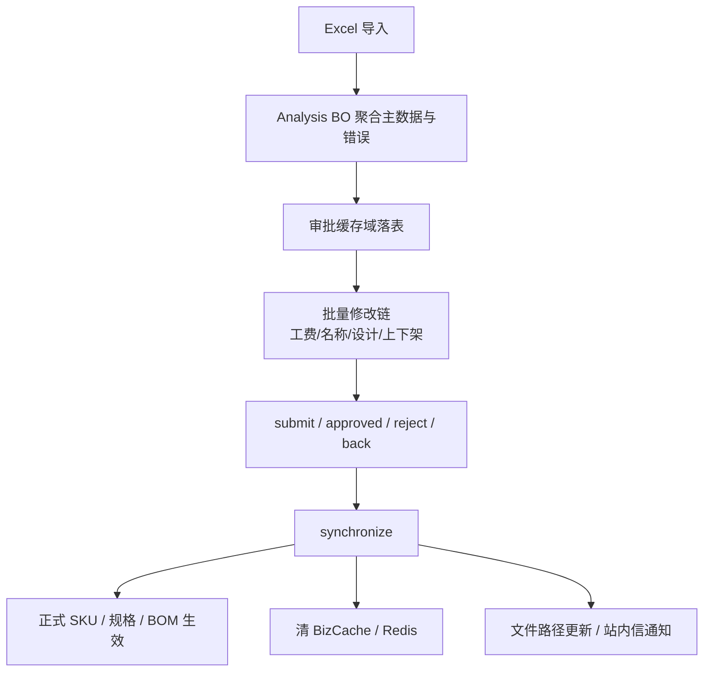

# SKU 审批域辅助链状态图

```mermaid
flowchart TD
    A["Excel 导入"] --> B["Analysis BO 聚合主数据与错误"]
    B --> C["审批缓存域落表"]
    C --> D["批量修改链<br/>工费/名称/设计/上下架"]
    D --> E["submit / approved / reject / back"]
    E --> F["synchronize"]
    F --> G["正式 SKU / 规格 / BOM 生效"]
    F --> H["清 BizCache / Redis"]
    F --> I["文件路径更新 / 站内信通知"]
```
