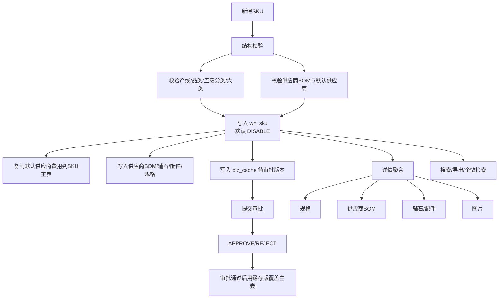

# 款式库能力图

```mermaid
flowchart TD
    A["新建SKU"] --> B["结构校验"]
    B --> C["校验产线/品类/五级分类/大类"]
    B --> D["校验供应商BOM与默认供应商"]
    C --> E["写入 wh_sku<br/>默认 DISABLE"]
    D --> E

    E --> F["复制默认供应商费用到SKU主表"]
    E --> G["写入供应商BOM/辅石/配件/规格"]
    E --> H["写入 biz_cache 待审批版本"]

    H --> I["提交审批"]
    I --> J["APPROVE/REJECT"]
    J --> K["审批通过后用缓存版覆盖主表"]

    E --> L["详情聚合"]
    L --> M["规格"]
    L --> N["供应商BOM"]
    L --> O["辅石/配件"]
    L --> P["图片"]

    E --> Q["搜索/导出/企微检索"]
```
