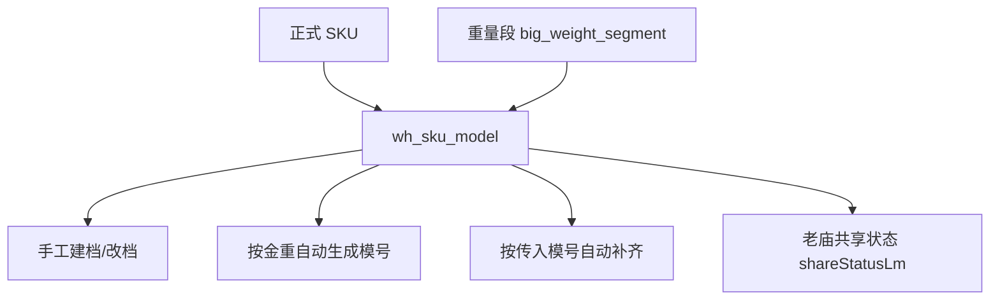

# 款式模号状态图

```mermaid
flowchart TD
    A["正式 SKU"] --> B["wh_sku_model"]
    C["重量段 big_weight_segment"] --> B

    B --> B1["手工建档/改档"]
    B --> B2["按金重自动生成模号"]
    B --> B3["按传入模号自动补齐"]
    B --> B4["老庙共享状态 shareStatusLm"]
```
