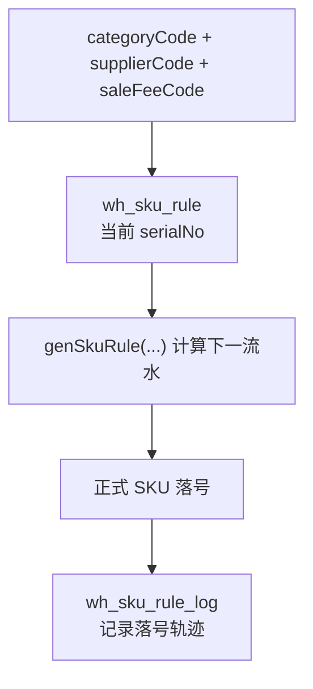

# SKU 编码规则状态图

```mermaid
flowchart TD
    A["categoryCode + supplierCode + saleFeeCode"] --> B["wh_sku_rule<br/>当前 serialNo"]
    B --> C["genSkuRule(...) 计算下一流水"]
    C --> D["正式 SKU 落号"]
    D --> E["wh_sku_rule_log<br/>记录落号轨迹"]
```
