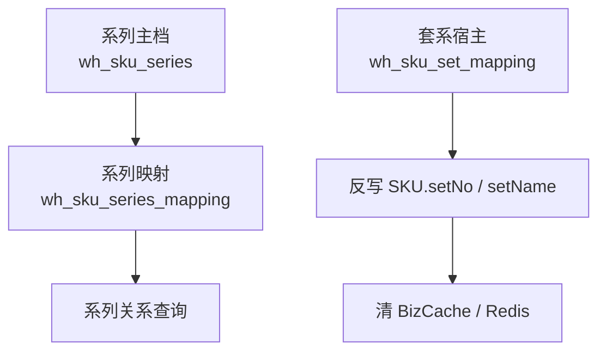

# 系列与套系映射状态图

```mermaid
flowchart TD
    A["系列主档<br/>wh_sku_series"] --> B["系列映射<br/>wh_sku_series_mapping"]
    C["套系宿主<br/>wh_sku_set_mapping"] --> D["反写 SKU.setNo / setName"]
    D --> E["清 BizCache / Redis"]
    B --> F["系列关系查询"]
```
