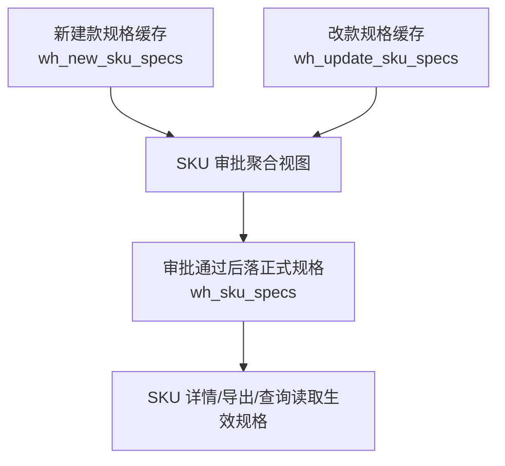

# SKU 规格状态图

```mermaid
flowchart TD
    A["新建款规格缓存<br/>wh_new_sku_specs"] --> C["SKU 审批聚合视图"]
    B["改款规格缓存<br/>wh_update_sku_specs"] --> C
    C --> D["审批通过后落正式规格<br/>wh_sku_specs"]
    D --> E["SKU 详情/导出/查询读取生效规格"]
```
