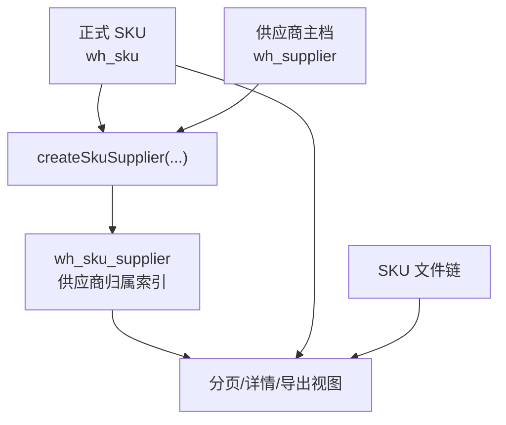

# SKU 供应商库状态图

```mermaid
flowchart TD
    A["正式 SKU<br/>wh_sku"] --> B["createSkuSupplier(...)"]
    C["供应商主档<br/>wh_supplier"] --> B
    B --> D["wh_sku_supplier<br/>供应商归属索引"]
    D --> E["分页/详情/导出视图"]
    A --> E
    F["SKU 文件链"] --> E
```
