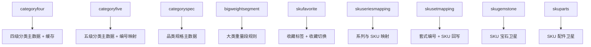

# 商品与 SKU 尾项能力图

```mermaid
flowchart TD
    A["categoryfour"] --> B["四级分类主数据 + 缓存"]
    C["categoryfive"] --> D["五级分类主数据 + 编号映射"]
    E["categoryspec"] --> F["品类规格主数据"]
    G["bigweightsegment"] --> H["大类重量段规则"]
    I["skufavorite"] --> J["收藏标签 + 收藏切换"]
    K["skuseriesmapping"] --> L["系列与 SKU 映射"]
    M["skusetmapping"] --> N["套式编号 + SKU 回写"]
    O["skugemstone"] --> P["SKU 宝石卫星"]
    Q["skuparts"] --> R["SKU 配件卫星"]
```
