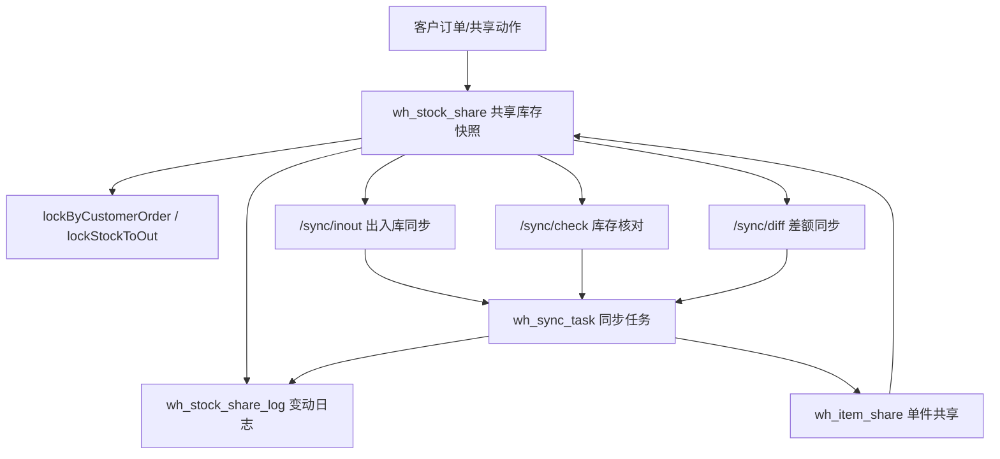

# 旧版共享库存域状态图

```mermaid
flowchart TD
    A["客户订单/共享动作"] --> B["wh_stock_share 共享库存快照"]
    B --> C["lockByCustomerOrder / lockStockToOut"]
    B --> D["/sync/inout 出入库同步"]
    B --> E["/sync/check 库存核对"]
    B --> F["/sync/diff 差额同步"]

    G["wh_item_share 单件共享"] --> B
    B --> H["wh_stock_share_log 变动日志"]
    D --> I["wh_sync_task 同步任务"]
    E --> I
    F --> I
    I --> H
    I --> G
```
