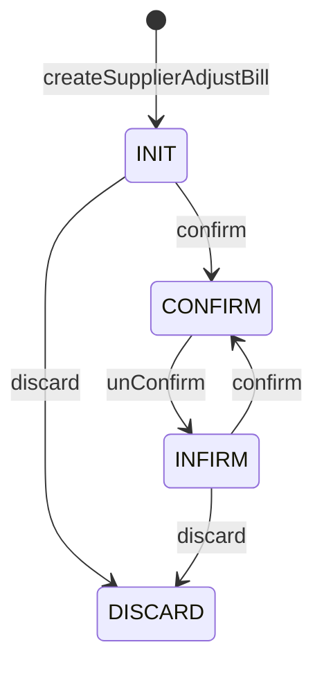

# 供应商应付账调整状态机图
> 来源：`SupplierAdjustBillServiceImpl`

## 说明
- `confirm` 代码层面只显式拦“已审不能重复审核”，未统一收敛到 `INIT/INFIRM`。
- `discard` 代码层面只禁止 `CONFIRM`，其他异常状态是否允许作废仍需业务确认。
- `saveAndConfirm` 本质是“create/update + confirm”的快捷入口，不引入新状态。
