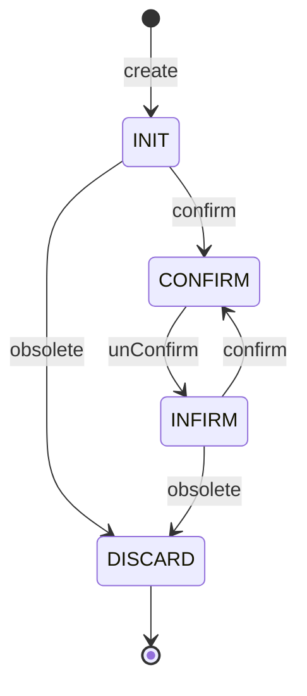

# 供应商来料单状态机图

```mermaid
stateDiagram-v2
    [*] --> INIT : create
    INIT --> CONFIRM : confirm
    INIT --> DISCARD : obsolete
    CONFIRM --> INFIRM : unConfirm
    INFIRM --> CONFIRM : confirm
    INFIRM --> DISCARD : obsolete
    DISCARD --> [*]
```

## 说明
1. 状态流与客户来料单共用同一套主服务
2. 差异主要不在状态机，而在审核/反审时的钱包分支
3. 跨日反审权限使用 `MATERIAL_INBOUND_SUPPLIER_CROSS_DAYS`
