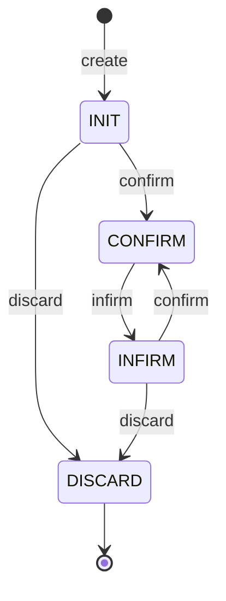

# 供应商出料单状态机图

```mermaid
stateDiagram-v2
    [*] --> INIT : create
    INIT --> CONFIRM : confirm
    INIT --> DISCARD : discard
    CONFIRM --> INFIRM : infirm
    INFIRM --> CONFIRM : confirm
    INFIRM --> DISCARD : discard
    DISCARD --> [*]
```

## 说明
1. 状态流与客户出料单共用同一套主服务
2. 供应商侧差异主要在 `2301/2302/2303` 的钱包分支和跨日权限
