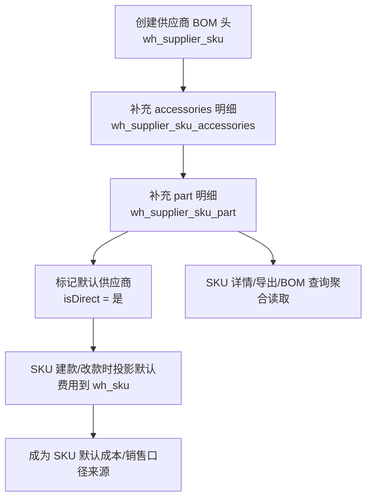

# 供应商款式 / BOM 状态图

```mermaid
flowchart TD
    A["创建供应商 BOM 头<br/>wh_supplier_sku"] --> B["补充 accessories 明细<br/>wh_supplier_sku_accessories"]
    B --> C["补充 part 明细<br/>wh_supplier_sku_part"]
    C --> D["标记默认供应商<br/>isDirect = 是"]
    D --> E["SKU 建款/改款时投影默认费用到 wh_sku"]
    C --> F["SKU 详情/导出/BOM 查询聚合读取"]
    E --> G["成为 SKU 默认成本/销售口径来源"]
```
