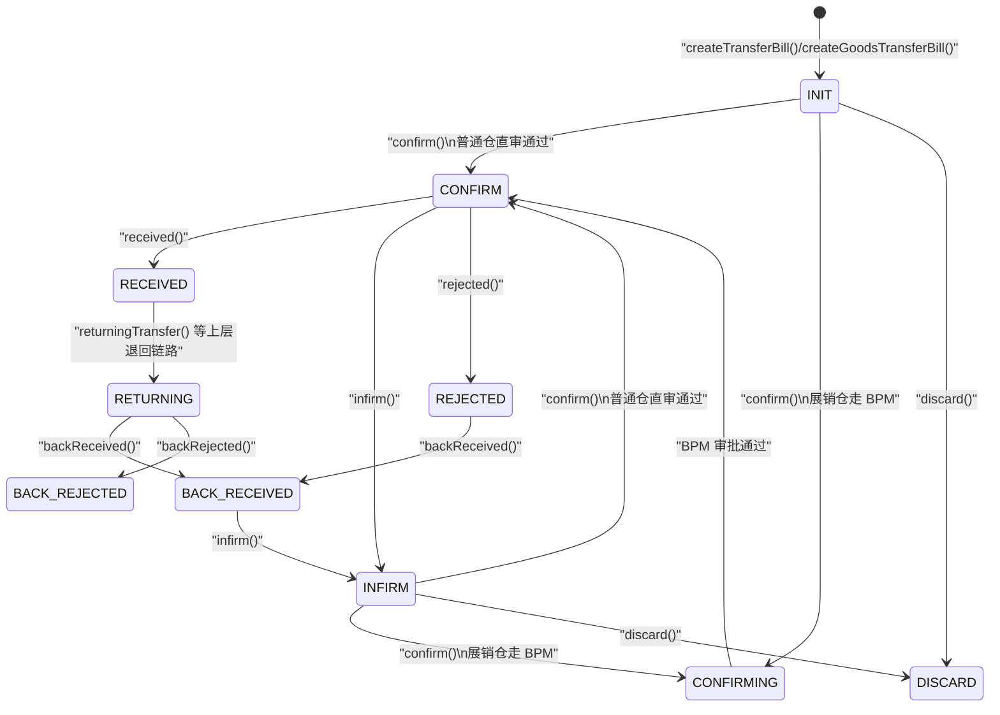
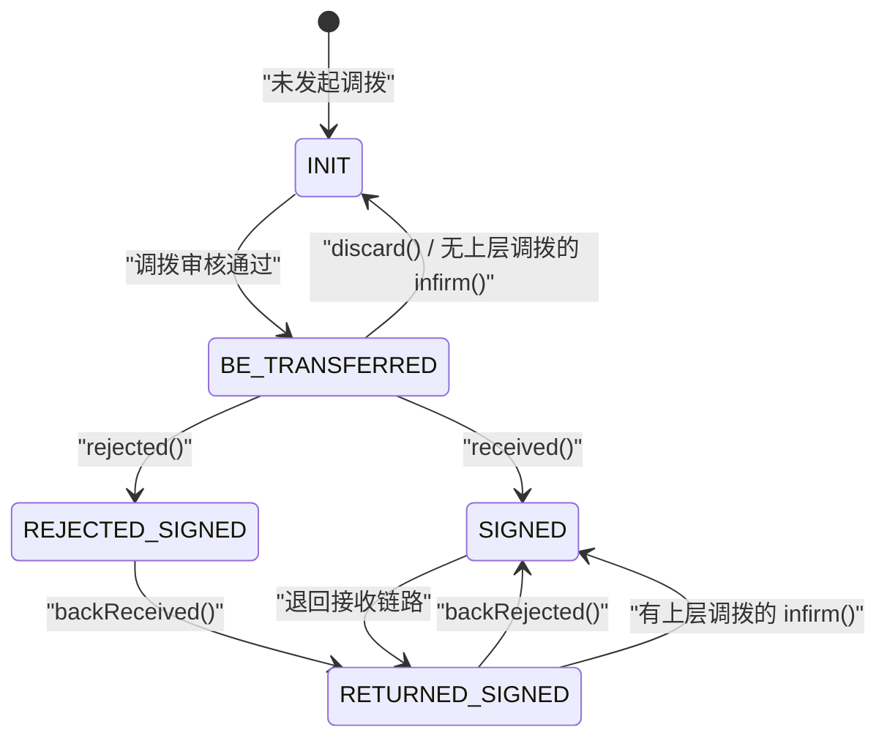

# 调拨状态机图
> 基于 commit: `48af575a1314636c88e9f05ca3cb4443f88865bd`，日期：2026-03-31

## 说明
- 单件调拨单 `wh_transfer_bill.bill_status` 与成品调拨单 `wh_goods_transfer_bill.bill_status` 复用同一套主状态机。
- 产品包 `wh_pack.transfer_status` 不是调拨单主状态，而是“源单据视角”的调拨阶段，需要与调拨单主状态分开理解。
- 成品调拨场景下，调拨单除了回写产品包，还可能回写 `wh_sale_bill.transferStatus`。

## 调拨单主状态机

## 源单据调拨状态机

## 关键迁移说明

### 调拨单主状态
1. `createTransferBill()`、`createGoodsTransferBill()` 新建后进入 `INIT`。
2. `confirm()` 在普通仓场景下直接 `INIT/INFIRM -> CONFIRM`。
3. 若目标仓是展销仓，则先 `INIT/INFIRM -> CONFIRMING`，待 BPM 审批通过后再进入 `CONFIRM`。
4. `received()` 把调拨单从 `CONFIRM -> RECEIVED`。
5. `rejected()` 把调拨单推进到 `REJECTED`。
6. `backReceived()` 把 `REJECTED/RETURNING -> BACK_RECEIVED`。
7. `backRejected()` 把 `RETURNING -> BACK_REJECTED`。
8. `infirm()` 把 `CONFIRM/BACK_RECEIVED -> INFIRM`。
9. `discard()` 把 `INIT/INFIRM -> DISCARD`。

### 源单据 `transfer_status`
1. 审核通过时，源单据统一回写：
   - `transferBillId`
   - `transferBillNo`
   - `transferType`
   - `transferStatus = BE_TRANSFERRED`
2. 接收后，源单据 `transferStatus -> SIGNED` 类终态。
3. 拒签后，源单据 `transferStatus -> REJECTED_SIGNED`。
4. 退回接收后，源单据 `transferStatus -> RETURNED_SIGNED`。
5. 退回拒签后，源单据 `transferStatus -> SIGNED`。
6. 作废时清空 `transferBillId / transferBillNo`；反审时若没有上层调拨则回 `INIT`，否则回 `SIGNED`。

## 单件调拨与成品调拨的差异
| 维度 | 单件调拨单 | 成品调拨单 |
|------|-----------|-----------|
| 主表 | `wh_transfer_bill` | `wh_goods_transfer_bill` |
| 明细表 | `wh_transfer_bill_detail` | `wh_goods_transfer_bill_detail` |
| 审核通过后库存/在途处理 | 以 EPC 和单件当前仓为核心 | 以成品库存和件数/金重为核心 |
| 回写目标 | 主要回写产品包等源单据 | 回写产品包，且源单据为结算单时还会回写 `wh_sale_bill` |

## 关键前置条件
| 动作 | 关键前置条件 |
|------|-------------|
| `confirm` | 调拨单状态必须是 `INIT/INFIRM`，且库存/当前仓仍满足调出条件 |
| `received` | 调拨单状态必须是 `CONFIRM` |
| `backReceived` | 调拨单状态必须是 `REJECTED/RETURNING` |
| `backRejected` | 调拨单状态必须是 `RETURNING` |
| `infirm` | 调拨单状态必须是 `CONFIRM/BACK_RECEIVED` |
| `discard` | 调拨单状态必须是 `INIT/INFIRM` |

## 与上下游实体的联动
1. 审核通过时：
   - 产品包 `transferStatus -> BE_TRANSFERRED`
   - 写入 `transferBillId / transferBillNo / transferType`
2. 接收、拒签、退回时：
   - 回写产品包 `transferStatus`
   - 成品调拨场景下，可能回写结算单 `transferStatus`
3. 反审、作废时：
   - 清理或回退源单据调拨字段
   - 单件场景会恢复 EPC 当前仓/状态
   - 成品场景会回滚成品库存

## 使用建议
- 后续 AI 若修改调拨状态流，至少同步检查：
  - [transferbill.md](/D:/ws/code/wms-api/docs/business/transferbill.md)
  - [goodstransferbill.md](/D:/ws/code/wms-api/docs/business/goodstransferbill.md)
  - [pack.md](/D:/ws/code/wms-api/docs/business/pack.md)
  - [salebill.md](/D:/ws/code/wms-api/docs/business/salebill.md)
  - [pack-state.md](/D:/ws/code/wms-api/docs/business/model/pack-state.md)
