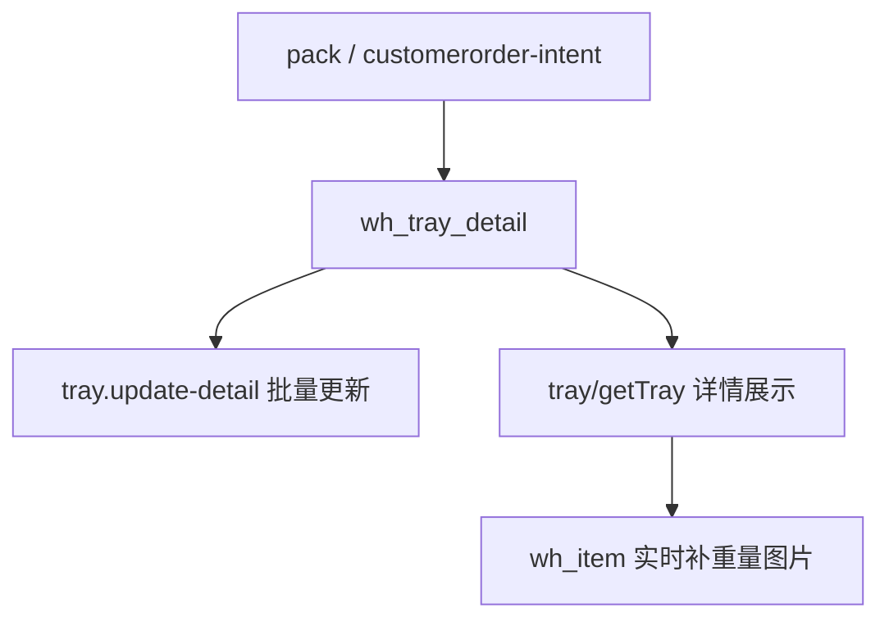

# 小包明细能力图

```mermaid
flowchart TD
    A["pack / customerorder-intent"] --> B["wh_tray_detail"]
    B --> C["tray.update-detail 批量更新"]
    B --> D["tray/getTray 详情展示"]
    D --> E["wh_item 实时补重量图片"]
```
