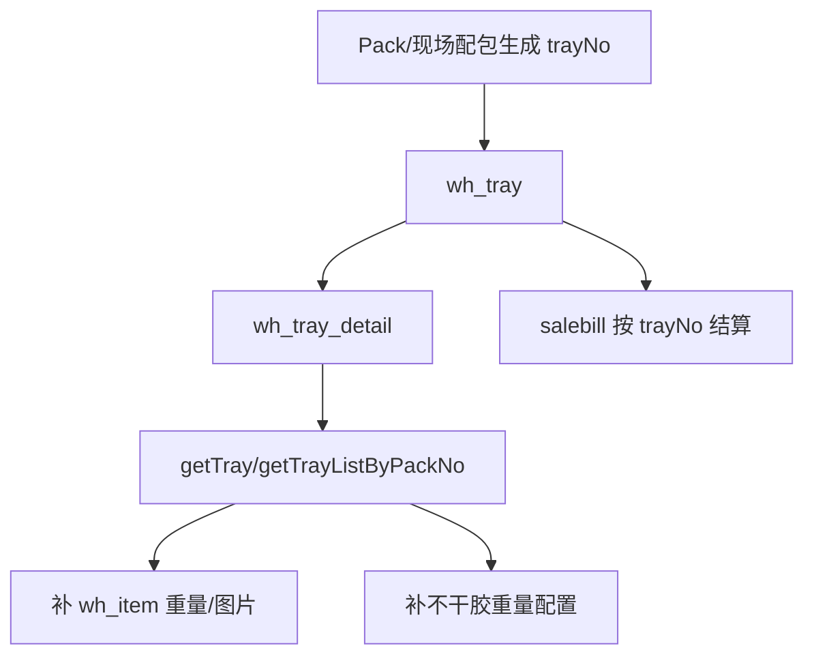

# 小包能力图

```mermaid
flowchart TD
    A["Pack/现场配包生成 trayNo"] --> B["wh_tray"]
    B --> C["wh_tray_detail"]
    C --> D["getTray/getTrayListByPackNo"]
    D --> E["补 wh_item 重量/图片"]
    D --> F["补不干胶重量配置"]
    B --> G["salebill 按 trayNo 结算"]
```
