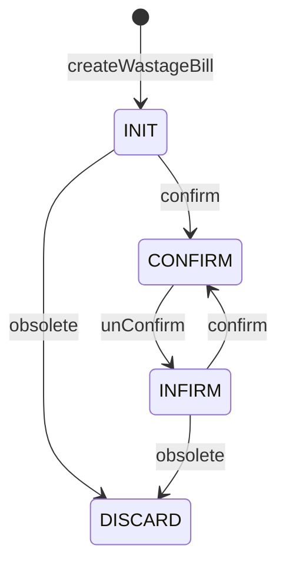

# 损耗单状态机图
> 来源：`WastageBillServiceImpl`

```mermaid
stateDiagram-v2
    [*] --> INIT: createWastageBill

    INIT --> CONFIRM: confirm
    INFIRM --> CONFIRM: confirm

    CONFIRM --> INFIRM: unConfirm

    INIT --> DISCARD: obsolete
    INFIRM --> DISCARD: obsolete
```

## 说明
- `confirm`、`unConfirm`、`obsolete` 都走 `BillStatusEnum` 标准校验。
- `unConfirm` 额外叠加了跨日权限控制：`WASTAGE_BILL_CROSS_DAYS`。
- 当前没看到 BPM 审批分支，审核/反审是业务接口直接驱动。
